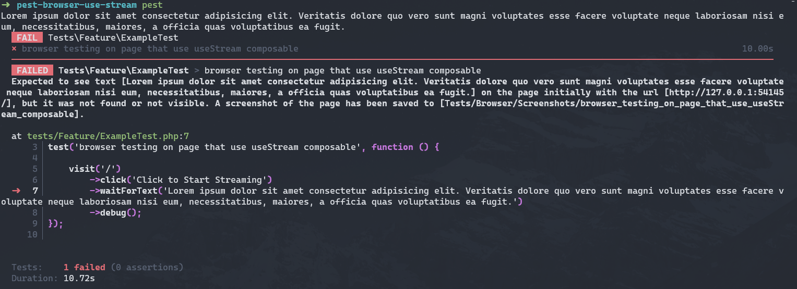

# Pest Browser Use Stream Issue

## The Issue

When using Laravel's `useStream` composable (`@laravel/stream-vue`) with Pest Browser Testing, the streamed data bypasses the browser UI completely and is output directly to the terminal console where the Pest test is running.

**Expected behavior:** The UI updates incrementally as data streams from the server.

**Actual behavior:** The stream freezes in the `isFetching` state, the UI never updates, and the streamed data appears in the terminal console instead.

### Visual Demonstration



_The streamed data appears in the terminal console instead of the browser UI_

### Video Demonstration

[](./public/video.mp4)

## Steps to Reproduce

1. **Install dependencies:**

    ```bash
    composer setup
    ```

2. **Install Playwright browsers (required for Pest browser testing):**

    ```bash
    npx playwright install
    ```

3. **Start the development server:**

    ```bash
    composer dev
    ```

4. **Run the browser test:**

    ```bash
    ./vendor/bin/pest tests/Feature/ExampleTest.php
    ```

5. **Observe:** The test will hang waiting for text that never appears in the browser, while the streamed data is logged to your terminal console.
